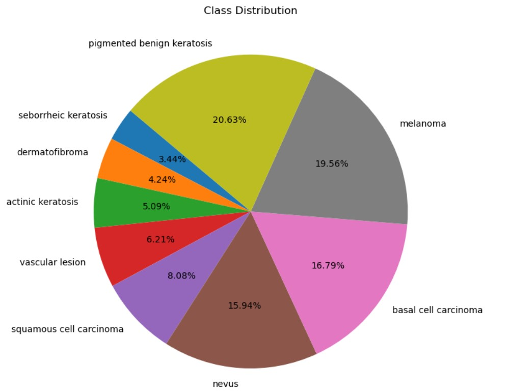
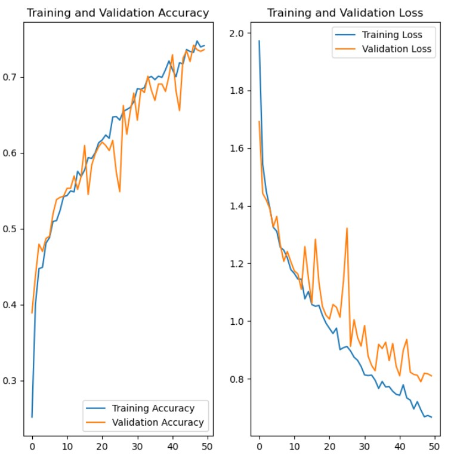
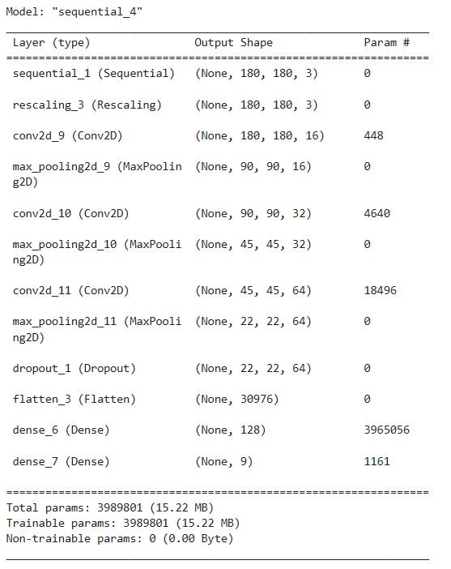

# Melanoma Detection Assignment

## **Problem Statement**

To build a Convolutional Neural Network (CNN) based model which can accurately detect melanoma.
Melanoma is a type of cancer that can be deadly if not detected early.
It accounts for 75% of skin cancer deaths. 
A solution that can evaluate images and alert dermatologists about the presence of melanoma has the potential to reduce a lot of manual effort needed in diagnosis.

## Table of Contents
* [General Info](#general-information)
* [Challenges and solutions proposed](#challenges-and-solutions-proposed)
* [Conclusions](#conclusions)
* [Technologies Used](#technologies-used)
* [Acknowledgements](#acknowledgements)

## General Information

The dataset can be downloaded from [here](https://drive.google.com/file/d/1xLfSQUGDl8ezNNbUkpuHOYvSpTyxVhCs/view?usp=sharing).

The dataset consists of 2357 images of malignant and benign oncological diseases, which were formed from the International Skin Imaging Collaboration (ISIC). All images were sorted according to the classification taken with ISIC, and all subsets were divided into the same number of images, with the exception of melanomas and moles, whose images are slightly dominant.

The data set contains the following diseases:

- Actinic keratosis
- Basal cell carcinoma
- Dermatofibroma
- Melanoma
- Nevus
- Pigmented benign keratosis
- Seborrheic keratosis
- Squamous cell carcinoma
- Vascular lesion

## Challenges and Solutions Proposed

1. **Class Imbalance**: Based upon the below chart it's evident that there's a clear class imbalance.  

  

It was addressed by introducing 500 extra images in each class using [Augmentor](https://augmentor.readthedocs.io/en/master/) so that none of the classes have very few samples.
  
2.**Overfitting and Underfitting**: Model showed Overfitting and Underfitting and was having poor accuracy. Thus it was tackled by addressing class imbalancing problem. 
  
3.**Execution**: Since google colab offers limited usage, thus it was challenging to run the model there. Thus I downloaded the datasets into local drive and built the model.In order to execut the notebook in local, one needs to download the datasets and place them in a folder datasets/. The final folder structure should be like datasets/Train, datasets/Test. In order to execute the notebook using datasets stored in google drive, one needs to uncomment the cell in the beginning and place the datasets as described before.
  
4.**Google Drive issues on Windows Platform**: In order to directly address the datasets through google drive, windows laptop was causing issues due to the following error **ModuleNotFoundError: No module named 'termios'** as termios package is available only on linux machines. Please refer to the following [link](https://github.com/bchao1/bullet/issues/2) for reference.
  
5.**Tensorflow GPU**: Execution time is a lot. Alternatively if you're having a high configuration GPU in your laptop For eg: Nvidia, you can enable it by downloading cuda libraries and tensorflow-gpu to make your execution faster. However you will need to downgrade your python version and create a new environment and install all the required libraries in that.

## Conclusions

- The Final CNN model gave best performances through the use of Augmentor without batch normalization.
  
- 
  

  
- It offered training and validation accuracies of above 70%.

## Technologies Used

- [Python](https://www.python.org/) - version 3.10.4
- [Pandas](https://pandas.pydata.org/) - version 2.1.4
- [Numpy](https://numpy.org/) - version 1.26.2
- [Matplotlib](https://matplotlib.org/) - version 3.8.0
- [Seaborn](https://seaborn.pydata.org/) - version 0.13.1
- [Tensorflow](https://scikit-learn.org/stable/) - version 2.15.0
- [Pathlib](https://docs.python.org/3/library/pathlib.html) - version 1.0.1

## Acknowledgements
The project was built using help and guidance based upon
- Live sessions of upGrad on CNN Models
- UpGrad tutorials on CNN

## Contact

Created by [@sharmaankit091](https://github.com/sharmaankit091)
